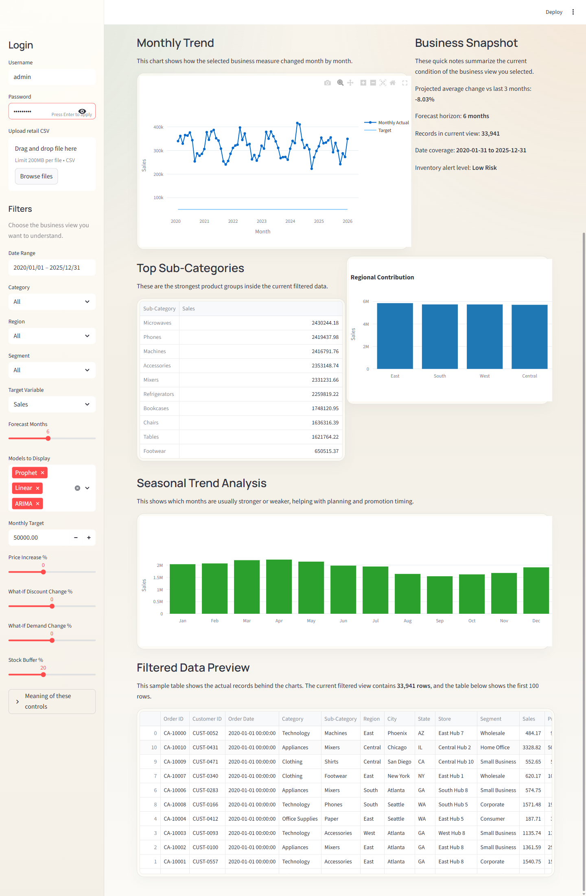
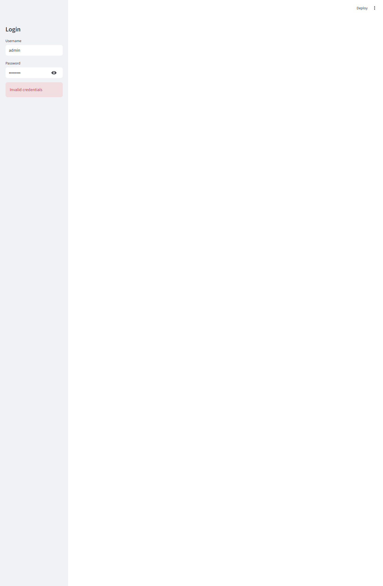
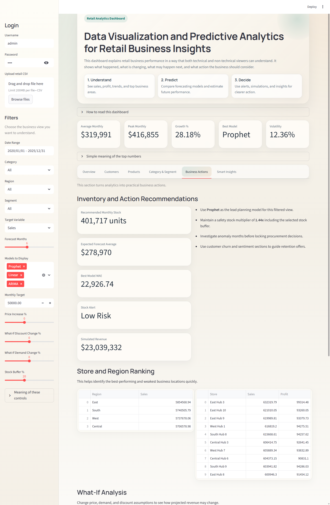
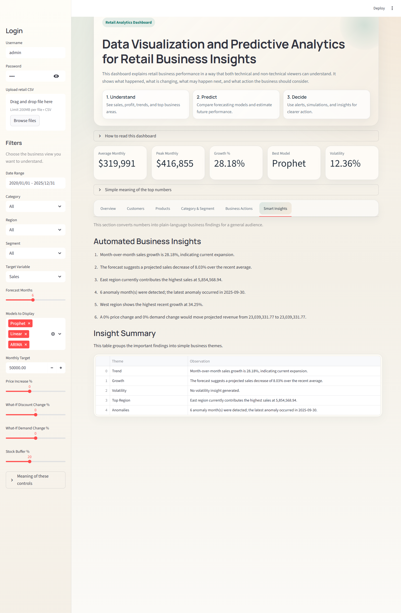

# Data Visualization and Predictive Analytics for Retail Business Insights

An interactive Streamlit dashboard for retail decision support that combines data visualization, customer intelligence, business insights, and scenario-based analysis in one presentation-ready application.

## Project Overview

This project helps users understand retail business performance using a simple and professional dashboard. It accepts retail CSV files, cleans and prepares the data, and turns the results into charts, summaries, customer analysis, and plain-language insights that are easy for both technical and non-technical viewers to understand.

The dashboard is designed to answer practical business questions such as:

- Which categories and segments are performing best?
- Which customers are high value or at risk?
- How do discounts affect sales and profit?
- What product groups are often bought together?
- How would revenue change if price or demand changes?
- What does the data mean in simple business language?

## Key Features

- Secure login flow for controlled dashboard access
- CSV upload support for custom retail datasets
- Built-in demo dataset with 33,000+ records for testing and presentation
- KPI cards for average monthly value, growth, volatility, and business snapshot
- Category and segment analysis with comparison charts and pivot views
- Customer segmentation based on spending, frequency, and recency
- Customer churn-risk view and review sentiment analysis
- Product pairing insights for cross-selling opportunities
- Discount impact analysis
- What-if scenario simulation for price, demand, and discount changes
- Automated business insights written in plain language
- Professional, presentation-friendly Streamlit UI

## Screenshots

### Overview Dashboard



### Customer Intelligence



### Business Actions



### Smart Insights



## Tech Stack

- Python
- Streamlit
- Pandas
- NumPy
- Plotly
- Prophet
- Scikit-learn
- Statsmodels
- ReportLab

## Project Files

- `app.py`: main Streamlit application
- `demo_retail_dataset_full.csv`: large demo retail dataset
- `requirements.txt`: Python dependencies
- `assets/screenshots/`: GitHub-ready dashboard screenshots
- presentation decks and research papers generated for the project

## How To Run

1. Open Command Prompt or PowerShell in the project folder.
2. Install dependencies:

```bash
pip install -r requirements.txt
```

3. Start the app:

```bash
python -m streamlit run app.py
```

4. Login with:

- Username: `admin`
- Password: `1234`

## Business Value

This project is more than a chart dashboard. It acts as a retail intelligence tool that helps in:

- performance monitoring
- customer understanding
- category and segment comparison
- product and discount strategy
- scenario-based decision support
- easy project presentation and reporting

## Future Improvements

- Add external variables such as holidays, weather, and campaign effects
- Improve customer intelligence with lifetime value and loyalty scoring
- Add live database connectivity and automated data refresh
- Extend export and reporting workflows for enterprise usage

## Author

Final year academic project on retail business analytics and decision support.
"# Data-Visualization-and-Predictive-Analytics-for-Retail-Business-Insights" 
